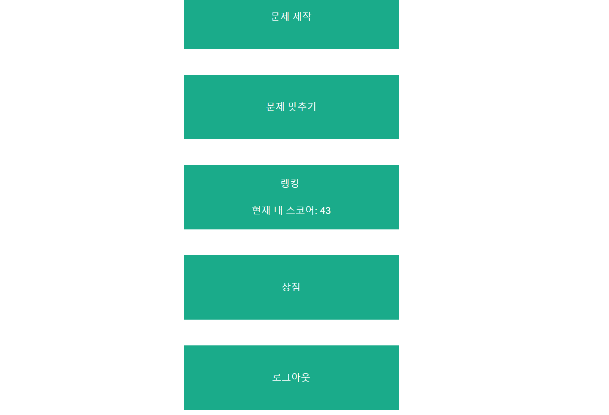
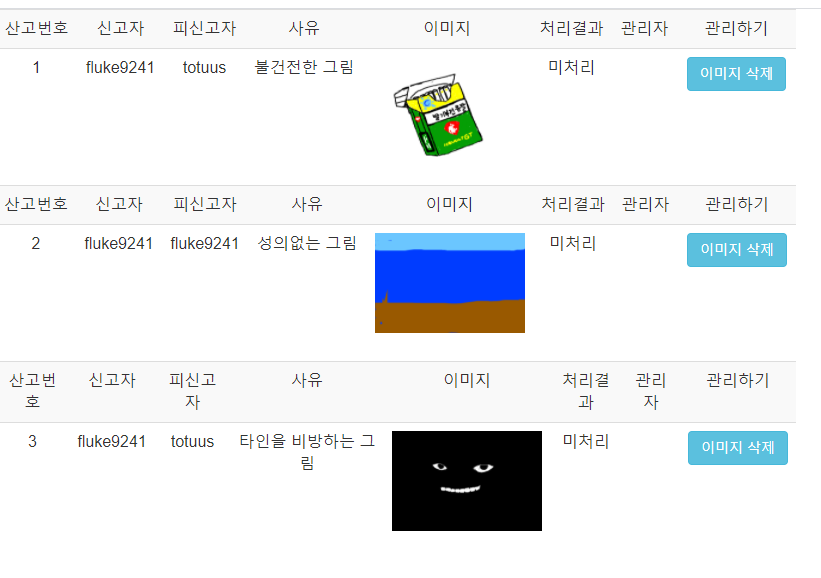
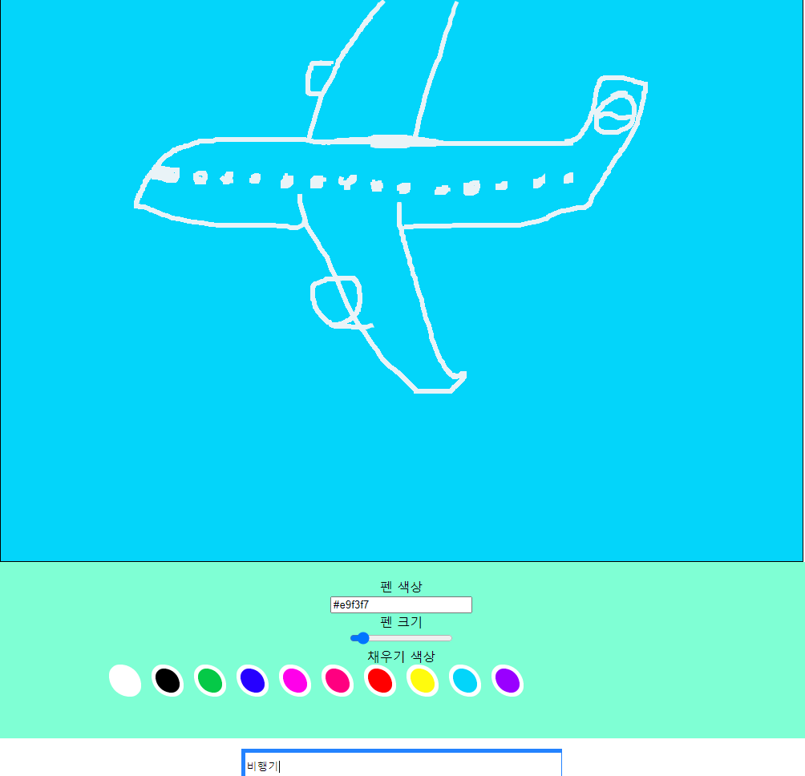
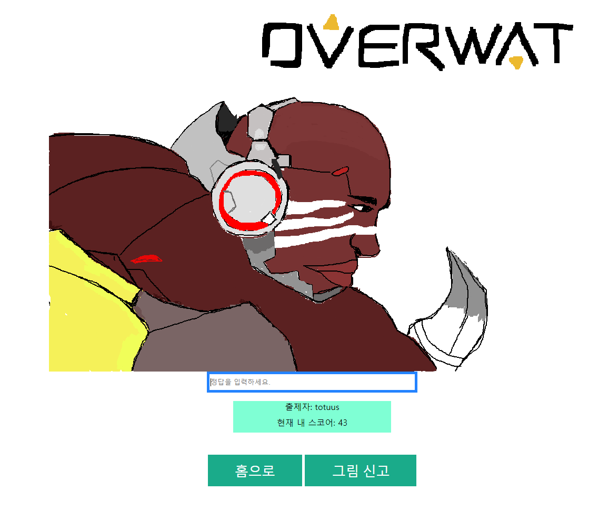
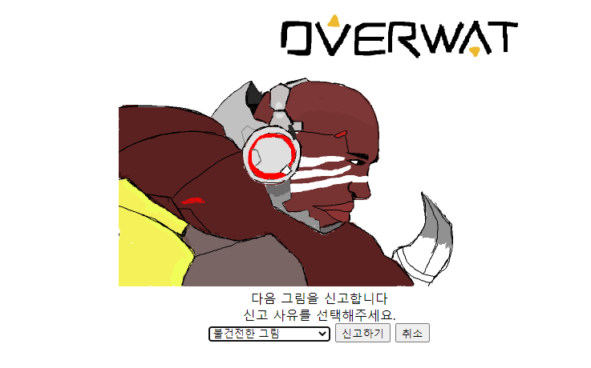

# 누구나 문제를 만들어서 공유하고 풀수있는 스케치퀴즈!

# Page Structure

### Page

- register.html : 회원 가입 페이지
- regcheck.jsp : 회원 가입 검증 페이지
- login.jsp : 로그인 페이지
- logincheck.jsp : 로그인 검증 페이지
- index.jsp : 로그인 후 메인 페이지
- canvas.jsp : 그림 제작 페이지
- send.jsp : 그림 제작 검증 페이지
- viewquize.jsp : 문제 제출 페이지
- answercheck.jsp : 제출한 문제 검증 페이지
- illegal.jsp : 그림 신고 페이지
- report.jsp : 신고 제출 검증 페이지
- mobile404.html : 모바일로 그림제작 접근 시 리턴되는 페이지
- fun.js : 그리기 등 주요 JS 함수 페이지
- css.css : CSS
- logout.jsp : 로그아웃 페이지
     

### JAVA

- idcheck.java : 회원 가입시 아이디 중복 검사 JAVA 함수
- Savefile.java : 문제 제출시 파일로 만들어서 저장 해주는 JAVA 함수
- Sha.java : 회원가입 및 로그인시 패스워드 암호화 해주는 JAVA 함수

# DB Structure

imagedata [id(varchar(30)),src(longtext),num(int),answer(varchar(30))] //이미지 저장 공간

userinfo [id(varchar(30)),pw(varchar(30)),score(int)] //User 정보 저장 공간

quizelog [num(int),id(varchar(30)),quizenum(int),userinput(varchar(30)),answer(varchar(30)),result(varchar(4)),time(datetime)]

//퀴즈 정답 제출 로그 저장 공간

illegalpicture [num(int),reporter varchar(30),illegaluser varchar(30),quizenum int,reason varchar(30),

time(datetime),result(varchar(10)),manager(varchar(20)),src(varchar(50))] //부적절 그림 신고 내역

# Update Log

#### 2020-09-15 첫 업로드

- 로그인 기능 구현.
- 회원가입 기능 구현.
- Canvas로 이미지 문제 제작 구현.
- 문제 맞추기 페이지 구현.

#### 2020-09-16

- 이미지저장방식 변경(Base64 → PNG로 저장.)
- 내 스코어 표시.
- 모바일 문제 제작 404페이지 제작(모바일에서 Canvas작동X).
- 로그인 및 회원가입시 패스워드에 SHA256 암호화 적용.
- 회원가입 아이디 중복 검사 적용.

#### 2020-09-17

- 문제 제출시 로그 남기도록 수정 [문제번호,아이디,퀴즈번호,입력값,정답여부,결과,시간]
- 패스워드 저장방식 변경 기존SHA256 인코딩 → SHA 인코딩 후 문자열 SubString(3,15)

#### 2020-09-18

- Undo기능 추가(= 오류덩어리).
- 펜 ColorPicker 추가.
- 배경채우기 색상 및 UI 수정.

#### 2020-09-19

- 펜 사이즈 User가 직접 설정 가능하도록 Range바 추가. (Min=1,Max=50,Step=1)
- 문제에 출제자 표시.
- 부적절 그림 신고기능 추가.

#### 2020-09-20

- 로그인시 관리자 여부 체크.
- 부적절 그림 신고 기능 관리자 페이지 추가.

#### 2020-09-21

- 관라자 페이지 접수건 블라인드 기능 추가.

    

메인 페이지 

    

관리자 페이지 

    

그림 제작 페이지 

    

문제 맞추기 페이지 

    

신고 페이지 

    
