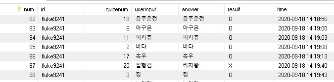
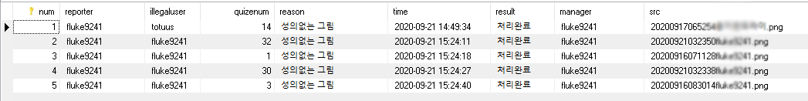

# 프로젝트명 : 스케치퀴즈
### 개발환경: 
#### Tomcat 8.0.x / JSP 2.3 / Servlet 3.1 / Open JDK 1.8.x / MariaDB 10.1.x UTF-8


### 시작계기

    딱히 없다. 포트폴리오도 만들어야하고 그냥 무언가 만들어 보고 싶던 와중에 당장 눈에 보이는 결과물을 
    찾게 되었고 그림판만 만들기엔 너무 식상해서 스케치 퀴즈로 방향을 돌렸다.
    생소한 프레임워크로 도전해보려다가 난관에 부딪히고 방향을 바꾸긴 했지만 이 또한 나중에 언급할 것 이다.

### Structure Setting

우선 기본적인 구상으로 필수적인 요소가 무엇인지 생각했다.
    
대략적인 틀은 다음과 같다.
    

   


1. 스케치퀴즈 문제를 누구나 만들 수 있어야하고 누구나 문제를 풀 수 있어야한다.

    - 문제를 만들기 위해선 그림판을 떠올렸다.   (그림판은 몹시 대단한 프로그램이었다.)
    - 문제를 풀기 위해서 랜덤으로 문제를 가져 와서 뿌려주어야한다.

2. 다수가 이용하므로 관리가 필요하다.

    -   아무래도 로컬에서 혼자 사용하는게 아니라 다수의 이용자를 염두에 두고 코드를 작성한다. 
    
    -   유저를 분리 해야 한다. (= 로그인 및 회원가입 기능을 넣어야한다.)
    
    -   관리자가 웹 상에서 유저를 제어 해야 한다. (= 관리자 페이지 추가.)
    
3. 이미지 저장 파일을 안전하고 효율적으로 관리해야한다.

    -   데이터 저장 방식을 고민 해야 한다. 
    

<br><br><br><br><br><br>        
               
               
               
```
회원가입(register.html) → 회원가입 유효성 검사(regcheck.jsp) → 로그인(login.jsp) → 

로그인 유효성 검사(logincheck.jsp) → 인덱스페이지(index.jsp) → 문제 제작(canvas.jsp) → 

문제 제출(send.jsp) → 문제 풀기(viewquize.jsp) → 로그 제출 → 문제 정답 여부 확인(answercheck.jsp) →
               
다음 문제 이동(viewquize.jsp) 및 해당 계정 스코어 +1;
```


-   #### 코딩의 시작은 DB ~~설계~~ 연동 부터(?)

    고수들은 말했다. 코딩하기 전에 설계를 먼저 잘(?) 해야 한다고.

    와닿지 않았다. 일단 코드부터 짰다.(~~이때 왜 그랬을까...~~)

    우선 기본적으로 DB 테이블을 생각 나는 대로 짰다.

    User 데이터를 담아 둘 테이블, 파일을 저장 해야 할 테이블이 기본적으로 필요 했고 컬럼은 의식의 흐름 대로 작성 했다.

    한국인들은 전투의 민족이 아니 던가. 스코어 기능을 넣으면 좀 더 활발 하게 운영될 것 이라는 믿음이 생겼다.

    또한 관리 겸 나중에 서비스 운영을 염두에 두고 접속 로그도 필요 해 보였다.

    테이블 구조는 다음과 같았다.

<br><br><br>

#### Table Structure

```
userinfo [id(varchar(30)),pw(varchar(30)),score(int)] 

imagedata [id(varchar(30)),src(longtext),num(int),answer(varchar(30))]

quizelog [num(int),id(varchar(30)),quizenum(int),userinput(varchar(30)),
answer(varchar(30)),result(varchar(4)),time(datetime)]
```
우선 userinfo에는 아이디 패스워드 스코어를 담을 공간을 할당하고

이미지 데이터는 그린이,img 파일 이름, 기본키 값, 정답을 담았다.

패스워드는 서버에서 자체적으로 암호화 시킬 예정이라 따로 패스워드 Type을 정하지 않았다.

Imgdata


<br>
로그는 기본키,정답제출자,문제번호,Input값,정답,정답결과,Time값을 담았다.

quizelog



<br>

코드를 작성하다보니 다수가 이용하는 만큼 부적절한 그림이 업로드되는걸 염두에 두어야했고

관리자가 하나하나 확인하고 업로드를 승인시킬지 생각했지만 그때그때 확인할수있다는 

보장이 없으므로 유저에게 신고를 접수 받고 접수된 건만 관리자가 확인할 수 있도록 했다.

따라서 신고를 접수 받을 테이블을 작성했다.

illegalpicture  (~~작명센스 참 웃프다..~~)


<br><br><br>

## 이번엔 코딩하면서 겪은 고초 몇 가지를 나열해 볼까 한다. 
-   #### 패스워드 암호화는 어떻게 할까.
    그냥 Base64나  MD5 , SHA로 덩그러니 하기엔 길이도 부담스럽고 SQL이 뚫리면 패스워드
    
    찾는 건 시간문제라고 생각해 알 수 없도록 SHA256으로 한번 인코딩 시킨후 문자열을 잘라서
    
    특정 인코딩이 방식이 발각 되지 않게 단순 하게 생각했다.
    
    ```
    public String sha256(String pw) {
        String SHA = "";
        MessageDigest sh;
        try
        {
            sh = MessageDigest.getInstance("SHA-256");
            sh.update(pw.getBytes());
            byte byteData[] = sh.digest();
            StringBuffer sb = new StringBuffer();
            for(int i=0; i<byteData.length;i++)
                sb.append(Integer.toString((byteData[i]&0xff) + 0x100, 16).substring(1));
            return SHA = sb.toString().substring(3,15); //SHA256인코딩 후 중간문자 12개만 추출.
        } catch (NoSuchAlgorithmException e) {
            System.out.println("err");
            e.printStackTrace();
        }
        return SHA;
    }
    ```
<br><br><br>
    


-   #### 이미지 데이터를 어떻게 저장할까.

    우선 이미지를 제출하면 클라이언트가 Canvas를 캡처 후 저장 해서 다시 서버로 보내야 한다고 생각 했다.
    
    몹시 번거로운 일이고 최대한 유저편의를 생각해보고 싶었기 때문에 차라리 Canvas를 Base64로 인코딩 후
    
    DB에 통채로 때려박자는게 첫 아이디어였다.
    
    그러나 Canvas에 한획 한획 그을수록 데이터의 크기는 기하급수적으로 늘어났다. (5획기준 24KB)
    
    이걸 DB가 데이터 손실 없이 잘 받을 수 있을지. 이걸 저장할 공간이 될까 라고 걱정을 했고
    
    구글링을 시작했다. 다행이도 LONGTEXT타입이 INT형으로 잡혀서 약 42억글자까지 담을 수 있단다.
    
    이정도면 충분하다 생각했고 바로 Base64로 SQL문을 날려버렸다.
    
    결과는 성공이었다.
    
    <br><br><br>
-   #### 조금 더 효울적으로 저장 할 수는 없을까?

    아무래도 이 방법은 서버와 클라이언트 둘 다 해로운 방법이라는 걸 알아 버렸다.
    
    클라이언트 입장에선 이미지로 불러 오는 게 아니라 텍스트로 불러오니 캐싱이 안되는 문제가 있었고.
    
    서버쪽에서는 아무래도 이미지 미리보기도 없고 파일명이 너무 길다 보니 원하는 파일 찾기도 힘들었고
    
    무엇보다 SQL파일의 용량이 엄청나게 늘어났다.
    
    결국 여러 조언을 받아 PNG타입으로 저장하기로 했고 클라이언트 측에서 날린 Base64 데이터를
    
    서버에서 PNG파일로 변환해 저장했고 이미지 파일 이름은 UUID를 적용할까 하다가
    
    그냥 TIMESTAMP값과 출제자 ID를 넣기로 했다. 
    
``` 
                Savefile s = new Savefile();
                Date now = new Date();
                SimpleDateFormat sf = new SimpleDateFormat("yyyyMMddhhmmss");
                String filename = sf.format(now)+id+".png";
                Savefile.img.decodeStringtoFile(url.substring(22),"tomcat/webapps/img/"+filename);
                


       
               public static void decodeStringtoFile(String encodesString, String outputFileName) throws IOException 
               {
               BASE64Decoder base64Decoder = new BASE64Decoder();
               InputStream inStream = new ByteArrayInputStream(encodesString.toString().getBytes("UTF-8"));
               BufferedOutputStream outStream = new BufferedOutputStream(new FileOutputStream(outputFileName));
               base64Decoder.decodeBuffer(inStream, outStream);
               inStream.close();
               outStream.close();
               }
```

최종 작성될 파일명은 <br> 20200916071235아이디.PNG<br> 이렇게 작성된다.


<br><br><br>
-   #### 그림판의 꽃(?) UNDO기능.


    지인에게 테스트를 부탁하고 피드백 받는 중 되돌리기 기능이 필요 하다는 요청이 있었다.
    
    곧 바로 구현을 시작 했고 첫 번째 떠오르는 자료 구조는 Stack이었다.
    
    유저가 한 획 그을 때 마다 Canvas를 저장 하고 Base64로 인코딩해서 Push했다. (~~Base64 참 좋아한다.~~)
    
    배열에 넣고 UNDO를 실행 할 때 마다  배열에서 Pop해서 Canvas를 새롭게 덮어서 그려주었다.

1. Problem
     - Undo를 세번 눌러야 비로소 Undo기능이 제대로 작동 하는 문제가 있었다.
     
2.  Why?
     - 한 획그을 때 마다 beginPath()가 실행이 되는데 시작과 끝 두개를 다 저장 하는 문제 였다.
    
3.  Solution
     - 첫 실행시 함수가 3번 적용 되도록 임시 방편을 세웠다.     
    
4. Thinking
    - 생각해 볼 점은 그림을 그리는 획이 많을 수록 Stack에는 대량의 데이터가 쌓일텐데<br>
      클라이언트에 무리가 가지는 않을까? (Stack 범위의 Limit를 줘야할 듯 하다.)

<br><br><br><br><br>

-   ### 신고 받은 이미지 관리는 어떻게?


    위에서 언급했듯이 다수가 이용하는 환경에 관리자가 사진을 하나하나 검토하기 힘들다는 전제하에
    유저들에게 신고를 접수 받고 접수받은 건에 대해서만 웹에서 관리 할 수 있으면 어떨까.
    우선 관리자 계정을 먼저 구분할 방법이 필요했고 다음과 같이 테이블을 하나 더 작성했다.
    
    Create table admin(permission varchar(30));
    
    일종의 Whitelist다. 여기 테이블에 등록 된 아이디는 관리자인 셈.
    
    관리자 로그인시 관리자페이지 버튼이 보이도록 코드를 작성했다.    

```
if(session.getAttribute("admin") == "1") %> 
```

관리자 페이지 <br>
